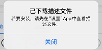
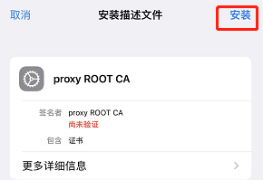
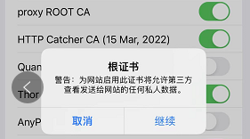
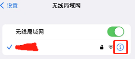
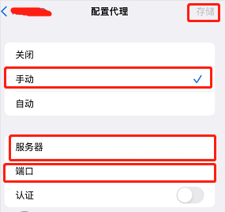

# :fa-regular fa-grid-2-plus: 辅助工具

本篇文档包含部分主流项目的搭建与使用

***

## 自动更新镜像

> 一个自动更新镜像与容器的工具  
> 官方仓库：[containrrr/watchtower](https://github.com/containrrr/watchtower)

```bash
docker run -d \
--name watchtower \
--restart unless-stopped \
-v /var/run/docker.sock:/var/run/docker.sock \
containrrr/watchtower -c \
--schedule "0 0 */2 * * *"
```
最下边的 Cron 表达式是更新频率（秒、分、时、日、月、周），可自行定义  
该工具容器会自动更新正在使用的镜像并在更新后自动重启相关容器

?> 使用该工具自动更新项目镜像与容器后，如果发现定时不起作用那么请尝试重启容器

***

## 账号管理

> 本项目开发者编写的一些工具脚本

- ### CK批量管理

  ?> 需要将 CK 写入至 **cookie.txt** 并存放在 **config** 目录下，一行一个，支持任意格式，但尽量不要带有特殊符号例如中文汉字

  > 工作原理为调用控制面板 [OpenApi](./pages/utils/OpenApi?id=%e4%ba%8c%e3%80%81%e5%86%85%e7%bd%ae%e6%8e%a5%e5%8f%a3) 的内置接口，因此需要启动控制面板服务，脚本需要进入容器内执行

  - #### 添加/更新

    ```bash
    bash <(curl -sSL https://supermanito.github.io/Helloworld/scripts/cookie_bp.sh) add
    ```

  - #### 删除

    ```bash
    bash <(curl -sSL https://supermanito.github.io/Helloworld/scripts/cookie_bp.sh) del
    ```

- ### 导出本地所有CK

  ```bash
  task https://supermanito.github.io/Helloworld/scripts/cookie_export.sh now
  ```

- ### 同步WSKEY

  ```bash
  wget https://supermanito.github.io/Helloworld/scripts/cookie_sync.sh
  bash cookie_sync.sh
  ```
  > 适用于IP黑了无法转换WSKEY，通过另一台正常的设备转换后同步过去，基于 `SSH` 命令，自行修改脚本内的配置信息

***

## 代挂面板

ㅤ

### Nark

> :fa-regular fa-user-vneck: 作者：Nolan  
> :fa-brands fa-telegram: 频道：~~[NolanNarkNotice](https://t.me/NolanNarkNotice)~~（已私有）

> [!WARNING|label:有限制的使用]
> 需要加入官方电报群才可以获取**授权许可**使用，目前官方频道已经私有，没有关注频道的朋友可能无法获取进群名额

- #### 配置方法

  - ##### 1. 定义映射目录

    ```bash
    ins_dir=/opt/nark
    ```
    > 用于设置配置文件与日志的存放位置，默认 `/opt` ，当前目录可用 `$(pwd)` 表示

  - ##### 2. 创建目录

    ```bash
    mkdir -p $ins_dir/Config
    ```

  - ##### 3. 上传授权文件并拷贝至 **Config** 目录

    ```bash
    mv -f Nark.lic $ins_dir/Config
    ```
    > 授权许可与你的电报账号关联绑定，注意妥善保管，不要多设备部署，遵守群组规则，长期不使用可能会被封禁

  - ##### 4. 新建 **Config.json** 配置文件并保存至 **Config** 映射目录下

    ```json
    {
      "//": "//开头的的都是注释，不要动，剩下的都按要求改自己的",
      "//MaxTab": "↓↓↓ 浏览器最多网页数量（最多同时登陆人数） ↓↓↓",
      "MaxTab": "4",
      "//Title": "↓↓↓ 网站标题 ↓↓↓",
      "Title": "Nark",
      "//Announcement": "↓↓↓ 网站公告(支持html网页格式) ↓↓↓",
      "Announcement": "为提高账户的安全性，请关闭免密支付。",

      "//CallBackUrl": "↓↓↓ 面板关联接口，用于自动提交短信登录获取的CK ↓↓↓",
      "CallBackUrl": "",

      "//Captchaurl": "↓↓↓ 授权中心国内缓存地址（如果面板没有部署在国内可直接删掉这条配置） ↓↓↓",
      "Captchaurl": "http://dun.z-yh.cn:65533",

      "//Proxy": "↓↓↓ 代理配置（支持没有认证的socks5以及http，Socks5需要填写socks5://ip:端口，不要填写下方的账户密码） ↓↓↓", 
      "Proxy": "",
      "//ProxyUser": "↓↓↓ 用于http代理认证的用户名 ↓↓↓",
      "ProxyUser": "",
      "//ProxyPass": "↓↓↓ 用于http代理认证的用户名对应密码 ↓↓↓",
      "ProxyPass": "",

      "//AutoCaptchaCount": "↓↓↓ 短信登录自动滑块次数5次，默认5次后手动滑块，可设置为0改为默认手动滑块 ↓↓↓",
      "AutoCaptchaCount": "5",
      "//Debug": "↓↓↓ 用于打印等待登录日志方便排错，默认无需定义保持为空 ↓↓↓",
      "Debug": ""
    }
    ```
    > [!NOTE|label:关于面板关联接口]
    > 如果与本项目面板部署在同一主机，地址可使用 `172.17.0.1:<映射端口号>` ，否则请填入用于访问的IP或域名  
    > 关于面板 OpenApi 开放接口用于授权验证的 `cookieApiToken` 的获取方法 [点此查看](./pages/utils/OpenApi?id=一、api-接口说明)  
    > 格式参考：[http://172.17.0.1:5678/openApi/cookie/webhook?api-token=abcdefghijklmnopqrstuvwxyz123456](./README ':disabled')

- #### 部署方法

  <!-- tabs:start -->

  ### **<span class="tab-badge"> **CLI - 命令行****

  ```bash
  docker run -dit \
  --name nark `# 容器名` \
  --hostname nark `# 主机名` \
  --network bridge `# 容器网络类型` \
  --restart always `# 开机自启` \
  -p 6789:80 `# 端口映射，"主机端口:容器端口"` \
  -v /opt/nark/Config:/app/Config `# 配置文件的主机挂载目录` \
  -v /opt/nark/logfile:/app/logfile `# 日志文件的主机挂载目录` \
  --privileged=true \
  nolanhzy/nark:latest
  ```

  ### **<span class="tab-badge"> **Compose - 编排****

  ```yaml
  version: "2.0"
  services:
    nark:
      image: nolanhzy/nark:latest  # 镜像名
      container_name: nark  # 容器名
      hostname: nark  # 主机名
      restart: always  # 开机自启
      tty: true
      privileged: true
      ports:
        - 6789:80  # 端口映射，格式为 "主机端口:容器端口"，主机端口号可自定义
      volumes:
        - /opt/nark/Config:/app/Config     # 配置文件的主机挂载目录
        - /opt/nark/logfile:/app/logfile   # 日志文件的主机挂载目录
  ```

  <!-- tabs:end -->

  > [!WARNING]
  > 注意不可以更改 `:` 右边的内容否则会报错，可更改默认映射端口号以此设置面板访问端口  
  > 若容器启动后不能访问网页或遇到其它错误请通过 `docker logs -f nark` 命令查看容器日志

  后期使用如若配置文件有所变动，需要重启容器才能生效  
  ARM 架构的设备需要更换镜像，将镜像后面的 `latest` 标签改为 `arm`

- #### 更新方法

  > 推荐使用 [Watchtower](./pages/utils/辅助工具?id=watchtower-自动更新镜像) 自动更新

  - ##### 手动更新

    ```bash
    docker run --rm -v /var/run/docker.sock:/var/run/docker.sock containrrr/watchtower -c --run-once nark
    ```

- #### 使用方法

  浏览器访问面板IP地址或域名加映射端口号（默认6789），登录日志可前往 **logfile** 映射目录进行查看

  > [!TIP]
  > 若想提高每日短信登录上限次数请打赏作者


  - ##### 无法同步账号？

    1. 检查面板接口授权token是否为 `openApiToken` ，如果是旧版请重置面板认证登录信息

    2. 检查配置文件（Config.json）中填写的面板地址是否正确，验证网络连通性  

    3. 尝试重启面板 `update shell && taskctl panel on`

  - ##### 关于常见报错 `Object reference not set to an instance of an object.`

    > 原因：无法与授权服务器建立连接  
    > 解决：在配置文件中更换 Captchaurl 授权中心缓存地址（以下任选其一），建议先通过 `ping` 指令测试连通性与速度

    - `http://dun.z-yh.cn:65533`
    - `http://45.88.194.149:6161`
    - `http://r1141418f5.goho.co:6161`

  - ##### 关于常见报错 `Value cannot be null. (Parameter 's')`

    > 原因：配置文件存在语法错误

ㅤ


### Rabbit

> :fa-regular fa-user-vneck: 作者：Mad Rabbit  
> :fa-brands fa-telegram: 频道：[Rabbit](https://t.me/Rabbit_one)

> [!NOTE|label:说明]
> 该面板有多个版本，这里推荐 **MadRabbit** 短信登录版本，具体区别详见[官方介绍](https://t.me/Rabbit_one/275)

> [!WARNING|label:有限制的使用]
> 需要先进入官方群组通过 `/register@CreazyRabbitBot` 进行注册，然后通过[官方机器人账号](https://t.me/CreazyRabbitBot)获取 `授权许可文件` 才能使用，关于如何进入群组详见官方频道

- #### 配置方法

  - ##### 1. 定义映射目录

    ```bash
    ins_dir=/opt/Rabbit
    ```
    > 用于设置配置文件与日志的存放位置，默认 `/opt` ，当前目录可用 `$(pwd)` 表示

  - ##### 2. 创建目录

    ```bash
    mkdir -p $ins_dir/Config
    ```

  - ##### 3. 上传授权文件并拷贝至 **Config** 目录

    ```bash
    mv -f Rabbit.lic $ins_dir/Config
    ```
    > 授权许可与你的电报账号关联绑定，注意妥善保管，不要多设备部署，长期不使用可能会被封禁

  - ##### 4. 新建 **Config.json** 配置文件并保存至 **Config** 映射目录下

    ```json
    {
      // 注释行必须为"// "，空格必须有，否则解析失败，同理，非注释行不要有"// "否则会被注释掉
      // 最多同时登陆人数
      "MaxTab": "4",
      // 标题
      "Title": "Rabbit",
      // 浏览器回收时间
      "Closetime": "5",
      // 授权中心服务器地址，不填默认45.88.194.149:1804
      "ServerHost": "62.204.54.137:1804",
      // 公告
      "Announcement": "为提高账户的安全性，请关闭免密支付。",
      // 开启DEBUG模式
      "debug": true,
      // 自动过验证码的次数
      "AutoCaptchaCount": "5",
      // 是否可复制ck，默认不可复制
      "REAL_CK": false,
      // 面板配置
      "Config": [
        {
          "ServerType": "hw",
          // 序号
          "HwKey": 1,
          // 服务器显示名称
          "HwName": "主服务器",
          // 面板地址
          "HwUrl": "",
          // 面板接口授权Token
          "HwApiToken": "",
          // 服务器账号上限
          "Hw_CAPACITY": 50
        }
      ]
    }
    ```
    > [!NOTE|label:关于面板关联接口]
    > 如果与本项目面板部署在同一主机，地址可使用 `172.17.0.1:<映射端口号>` ，否则请填入用于访问的IP或域名  
    > 关于面板 OpenApi 开放接口用于授权验证的 `cookieApiToken` 的获取方法 [点此查看](./pages/utils/OpenApi?id=一、api-接口说明)  

    下面是关于服务器的配置示例
    ```json
    "Config": [
      // 第一个服务器
      {
        "ServerType": "hw",
        "HwKey": 1,
        "HwName": "服务器1",
        "HwUrl": "http://172.17.0.1:5678",
        "HwApiToken": "88888888",
        "Hw_CAPACITY": 50
      },
      // 第二个服务器
      {
        "ServerType": "hw",
        "HwKey": 2,
        "HwName": "服务器2",
        "HwUrl": "http://<ip>:5678",
        "HwApiToken": "<token>",
        "Hw_CAPACITY": 50
      }
    ]
    ```

- #### 部署方法

  > 若部署其它版本需更改对应镜像名称，具体对应：`MadRabbit ➜ madrabbit`，`FastRabbit ➜ fastrabbit`  
  > 若同时部署多个版本注意映射端口不要设置冲突，可共用同一配置文件即无需更改映射目录

  <!-- tabs:start -->

  ### **<span class="tab-badge"> **CLI - 命令行****

  ```bash
  docker run -dit \
  --name madrabbit `# 容器名` \
  --hostname madrabbit `# 主机名` \
  --network bridge `# 容器网络类型` \
  --restart always `# 开机自启` \
  -p 6790:1234 `# 端口映射，"主机端口:容器端口"` \
  -v /opt/Rabbit/Config:/Rabbit/Config `# 配置文件的主机挂载目录` \
  --privileged=true \
  ht944/madrabbit:latest
  ```

  ### **<span class="tab-badge"> **Compose - 编排****

  ```yaml
  version: "2.0"
  services:
    madrabbit:
      image: ht944/madrabbit:latest  # 镜像名
      container_name: madrabbit  # 容器名
      hostname: madrabbit  # 主机名
      restart: always  # 开机自启
      tty: true
      privileged: true
      ports:
        - 6790:1234  # 端口映射，格式为 "主机端口:容器端口"，主机端口号可自定义
      volumes:
        - /opt/Rabbit/Config:/Rabbit/Config # 配置文件的主机挂载目录
  ```

  <!-- tabs:end -->

  > [!WARNING]
  > 注意不可以更改 `:` 右边的内容否则会报错，可更改默认映射端口号以此设置面板访问端口  
  > 若容器启动后不能访问网页或遇到其它错误请通过 `docker logs -f madrabbit` 命令查看容器日志

  后期使用如若配置文件有所变动，需要重启容器才能生效  
  ARM 架构的设备需要更换镜像，将镜像后面的 `latest` 标签改为 `arm`

  > [!TIP|label:友情提示]
  > 为了确保使用最新版本，请在部署完成后[更新源码](./pages/utils/辅助工具?id=更新源码)，详见下方内容

- #### 更新方法

  > 请根据实际通知要求进行更新操作

  - ##### 更新源码

    访问面板自动更新接口路径 `/api/update` 或进入到终端执行 `git pull`，然后重启容器

  - ##### 更新镜像

    ```bash
    docker run --rm -v /var/run/docker.sock:/var/run/docker.sock containrrr/watchtower -c --run-once madrabbit
    ```

- #### 使用方法

  浏览器访问面板IP地址或域名加映射端口号（默认6790）

  > [!TIP]
  > 若想提高每日登录上限次数请访问小卖铺打赏作者，然后自行充值

ㅤ

### CKTool

> :fa-regular fa-user-vneck: 作者：联合作者  
> :fa-brands fa-telegram: 频道：[autoProxyPool](https://t.me/autoProxyPool)

> [!NOTE|label:这是什么？]
> 一个通过自建代理服务器进行全自动抓包协助用户获取 wskey 的面板  
> 客户根据前端页面上的提示进行操作，通过代理与服务端建立连接，服务端自动分析抓包内容获取wskey并提交至面板

- #### 部署方法

  - ##### 1. 启动容器

    <!-- tabs:start -->

    ### **<span class="tab-badge"> **CLI - 命令行****

    ```bash
    docker run -dit \
    --name proxy-support `# 容器名` \
    --hostname proxy-support `# 主机名` \
    --network bridge `# 容器网络类型` \
    --restart always `# 开机自启` \
    -p 8080:8080 `# 端口映射，"主机端口:容器端口"` \
    -v /opt/proxy-support:/run/data `# 配置文件的主机挂载目录` \
    --privileged=true \
    mzzsfy/proxy-support:latest
    ```

    ### **<span class="tab-badge"> **Compose - 编排****

    ```yaml
    version: "2.0"
    services:
      madrabbit:
        image: mzzsfy/proxy-support:latest  # 镜像名
        container_name: proxy-support  # 容器名
        hostname: proxy-support  # 主机名
        restart: always  # 开机自启
        tty: true
        privileged: true
        ports:
          - 8080:8080  # 端口映射，格式为 "主机端口:容器端口"，主机端口号可自定义
        volumes:
          - /opt/proxy-support:/run/data # 配置文件的主机挂载目录
    ```

    <!-- tabs:end -->

    > [!WARNING]
    > 注意不可以更改 `:` 右边的内容否则会报错，可更改默认映射端口号以此设置面板访问端口  
    > 若容器启动后不能访问网页或遇到其它错误请通过 `docker logs -f proxy-support` 命令查看容器日志

  - ##### 2. 上传依赖并配置

    > [:fa-regular fa-folder-arrow-down: 点击此处下载](scripts/proxy-support-recourse.zip ':ignore')（依赖压缩包）

    解压后根据文件内要求进行上传操作并配置，可以不对接面板，默认会在容器日志中打印获取到的账号

    如果想对接多个面板可在配置文件设置新的独特键并参照插件内函数再写一个新的请求模板函数，代码逻辑很简单

- #### 客户操作指南

  > 对方提供给您的自助登录网址在以下的教程内容中简称为**面板**，注意请使用系统浏览器APP访问网址不要用微信打开

    <div>
    <details>

    <summary title="苹果">:fa-brands fa-apple: 苹果</summary>

    > 请通过 :fa-brands fa-safari: Safari 浏览器APP访问**面板**

    - ###### 1. 下载描述文件

      在面板点击 `安装证书` 按钮，此时会弹窗询问是否允许，点击 `允许`，然后点击 `关闭`

       

    - ###### 2. 安装描述文件

      回到主屏幕，进入设置APP，在iCloud账号头像下方点击 `已下载的描述文件`，右上角点击 `安装`，如果手机设置了锁屏密码那么在此时会验证，验证通过后连续点击两次 `安装`，直到在签名者栏里显示 <span style="color: green">已验证 :fa-solid fa-check:</span>

        
      

      若提示安装失败且不是第一次使用那么代表你已经安装过了，跳过该步骤

    - ###### 3. 信任描述文件

      在设置APP进入 `通用` - `关于本机` 下滑至底部（也可以直接在设置主界面的顶部搜索栏输入 `证书` 点击第一个搜索结果），点击 `证书信任设置`，勾选启用 `proxy ROOT CA`，弹窗点击 `继续`

      

    - ##### 4. 配置代理并连接

      在设置APP进入 `无线局域网`，点击你已连接Wi-Fi名称右边的感叹号

      

      下滑至底部找到 `HTTP代理`，点击 `配置代理` - `手动`，进行如下两步操作：  
      1）切换至面板页面，点击 `获取代理` - `复制地址` 按钮，返回设置APP，长按 `服务器` 输入框点击 `粘贴`；  
      2）切换至面板页面，点击 `获取代理` - `复制端口` 按钮，返回设置APP，长按 `端口` 输入框点击 `粘贴`；

      

      填入两处内容后在右上角点击 `存储` 并返回上层界面，重新启用无线局域网并连接至你刚才连接的 Wi-Fi 网络

      > [!TIP]
      > 连接代理后您的设备将无法使用其它网络，注意合理安排时间

      此时需要验证是否已连接上代理服务器，打开浏览器APP，随意访问一个网站例如百度，如果网页显示 `你正在使用代理访问其他内容` 相关字样则代表代理连接成功，请进行下一步，否则请认真查看教程按照顺序操作

    - ##### 5. 获取账号信息

      打开已登录的京东APP，点击首页右上角的消息图标，点击进入任意一条消息对话并等待其内容显示加载完整，速度可能较慢请耐心等待

      

      加载完后连续左上角返回两次至首页，点击底栏 `购物车` 查看商品标题是否显示为 `已获取到wskey请关闭代理` 字样，如果显示则表示账号获取成功，否则请认真查看前面的教程并按照按照顺序操作

      

      > [!NOTE|label:我的购物车中没有商品怎么办？]
      > 在购物车页面中，随意加购一个页面下方推荐的商品即可

    - ##### 6. 关闭代理

      在设置APP进入 `无线局域网`，点击你已连接Wi-Fi名称右边的感叹号，下滑至底部找到 `HTTP代理`，点击 `配置代理` - `关闭`。

    > 到这里就结束了，如若抓取成功注意及时通知对方

    </details>
    </div>

    <div>
    <details>
    <summary title="安卓及鸿蒙">:fa-brands fa-android: 安卓 及 <a></a> 鸿蒙</summary>

      > 请通过系统内置浏览器APP访问**面板**

      - ###### 1. 下载证书

        在面板点击 `安装证书` 按钮，此时会询问或自动下载一个名为 `ca.crt` 的文件，如果没有自动下载那么请操作下载

        > [!TIP]
        > 如果您修改了文件的默认下载位置那么请牢记您配置的路径，不建议修改下载位置，部分手机品牌的系统会自动下载而不会询问下载路径

      - ###### 2. 安装证书

        在系统设置APP中搜索证书，点击进入 `从存储设备安装证书` 相关字样，点击 `CA证书`，此时可能会提示安全风险警告（请忽略），点击 `仍然安装/继续`，然后可能会需要验证您的身份以进行确认

         

        之后会进入一个浏览文件的界面让您选择证书的位置，此时需要找到证书的保存位置，需要进入到内部存储界面（不同手机系统界面不一样），如果看不到内部存储就点击顶部的折叠 `菜单按钮` 并选择 `显示内部存储` 或您的设备型号相关字样

        > [!TIP]
        > 如果您的系统进入后就是内部存储界面那么请直接进行下面的操作

        

        接着进入到 `Download` 文件夹，选择刚刚下载的 `ca.crt` 证书文件（如果没有这个文件那么就找到并进入 `Browser` 文件夹），点击 `确定/完成` 进行安装

        

        > [!TIP]
        > 如果您修改了浏览器下载文件的默认存放目录那么就进入对应位置

      - ###### 3. 配置代理并连接

        进入到系统设置APP的WLAN设置中，需要进入到Wi-Fi的高级配置界面，如果右边没有小齿轮就长按或点按已连接的Wi-Fi并点击修改配置，进入高级配置页面后下滑至底部找到 `HTTP代理`，点击 `配置代理` - `手动`，进行如下两步操作：  
        1）切换至面板页面，点击 `获取代理` - `复制地址` 按钮，返回设置APP，长按 `服务器/主机名` 输入框点击 `粘贴`；  
        2）切换至面板页面，点击 `获取代理` - `复制端口` 按钮，返回设置APP，长按 `端口` 输入框点击 `粘贴`；

        

        填入两处内容后点击 `保存` 并返回上层界面，重新启用WLAN并连接至你刚才连接的Wi-Fi网络

        > [!TIP]
        > 连接代理后您的设备将无法使用其它网络，注意合理安排时间

        此时需要验证是否已连接上代理服务器，打开浏览器APP，随意访问一个网站例如百度，如果网页显示 `你正在使用代理访问其他内容` 相关字样则代表代理连接成功，请进行下一步，否则请认真查看教程按照顺序操作

      - ##### 4. 获取账号信息

        打开已登录的京东APP，点击首页右上角的消息图标，点击进入任意一条消息对话并等待其内容显示加载完整，速度可能较慢请耐心等待

        

        加载完后连续左上角返回两次至首页，点击底栏 `购物车` 查看商品标题是否显示为 `已获取到wskey请关闭代理` 字样，如果显示则表示账号获取成功，否则请认真查看前面的教程并按照按照顺序操作

        

        > [!NOTE|label:我的购物车中没有商品怎么办？]
        > 在购物车页面中，随意加购一个页面下方推荐的商品即可

      - ##### 5. 关闭代理

        进入到系统设置APP的WLAN设置中，根据第3步的操作将代理服务器设置为 `无` 并保存

      > 到这里就结束了，如若抓取成功注意及时通知对方  

      > [!NOTE|label:刚才是不是安装了个什么证书，它对我的手机有没有影响？]
      > 没有任何影响。但是部分手机品牌的系统可能会在锁屏界面或下拉菜单提示由于安装了证书导致网络流量不安全相关含义的小字警告，如果您不想看见它可以进入到系统设置APP搜索并进入 `用户证书` 界面长按删除

    </details>
    </div>


***

## 脚本代理

ㅤ

### AutoProxyPool

> :fa-regular fa-user-vneck: 作者：联合作者  
> :fa-brands fa-telegram: 频道：[autoProxyPool](https://t.me/autoProxyPool)

> [!NOTE|label:这是什么？]
> 一个用于对接代理池的代理整合工具，可玩性较高  
> 可通过该工具对接多个代理池，使用时只需连接一个代理地址即可实现自动切换代理池，规则配置丰富

- #### 获取代理池

  > 携趣网络官网：[www.xiequ.cn](https://www.xiequ.cn)  
  > 自行注册并开通免费代理池业务以获取你的代理池接口地址（如图）  
  > 免费代理池需要绑定公网IP才可以使用，如果没有那么可通过官方接口动态调整

  

  这里只简单介绍一个免费的代理池供大家参考，其它付费产品例如星光代理等自行研究  
  如想购买付费代理业务可选择流量类产品，比限制次数的套餐更划算  

- #### 部署方法

  <!-- tabs:start -->

  ### **<span class="tab-badge"> **CLI - 命令行****

  ```bash
  docker run -dit \
  --name auto-proxy-pool `# 容器名` \
  --hostname auto-proxy-pool `# 主机名` \
  --network bridge `# 容器网络类型` \
  --restart always `# 开机自启` \
  -p 8080:8080 `# 端口映射，"主机端口:容器端口"` \
  -v /opt/auto-proxy-pool:/run/data `# 配置文件的主机挂载目录` \
  --privileged=true \
  mzzsfy/auto-proxy-pool:latest
  ```

  ### **<span class="tab-badge"> **Compose - 编排****

  ```yaml
  version: "2.0"
  services:
    madrabbit:
      image: mzzsfy/auto-proxy-pool:latest  # 镜像名
      container_name: auto-proxy-pool  # 容器名
      hostname: auto-proxy-pool  # 主机名
      restart: always  # 开机自启
      tty: true
      privileged: true
      ports:
        - 8080:8080  # 端口映射，格式为 "主机端口:容器端口"，主机端口号可自定义
      volumes:
        - /opt/auto-proxy-pool:/run/data # 配置文件的主机挂载目录
  ```

  <!-- tabs:end -->

  > [!WARNING]
  > 注意不可以更改 `:` 右边的内容否则会报错，可更改默认映射端口号以此设置面板访问端口  
  > 若容器启动后不能正常使用请通过 `docker logs -f auto-proxy-pool` 命令查看容器日志

- #### 配置方法

  - ##### 代理配置

    第一次启动容器后需在映射目录新建一个 **pool.yaml** 配置文件，内容如下：

    ```yaml
    defaultCheckUrl: http://baidu.com/ # 代理默认检测地址，用于检测通过代理池提取到的代理IP是否有效
    changeRequest:
      - hostRegex: .* # 用于指定通过代理的请求链接（根据正则表达式匹配，默认 .* 表示匹配全部，若请求链接不在此规则内则会通过本机自身网络快速放通）
        proxy: proxy # 指定配置 
    upstream:
      proxy: # 自定义配置名称
        template: '{{$x := regexFindAll "\\d{1,3}(\\.\\d{1,3}){3}:\\d{2,5}" . -1}}{{range $s := $x}}{{printf "http://%s" $s}}{{end}}' # 默认提取代理池ip的正则（不懂勿动）
        apiUrl: <你的代理池API> # 接口回传需为txt格式
        lifecycle: -1 # 代理IP的生命周期，即从代理池提取到的IP的有效时长（填-1为自动检测即不指定，若需指定直接定义正整数，单位/秒）
        maxSize: 1 # 最多保留上游IP数量即同时维护几个有效ip，代理池消耗速度的倍数等于该设定值
        requestInterval: 100ms # 从代理池获取代理IP的请求间隔，注意不要太快否则可能会被服务器拉黑
    ```

    上面写的是一个最简单的配置文件，更多配置参数详见模板文件，可前往官方群组讨论  
    若想仅适用于JD脚本，可将 `hostRegex` 的值指定为 `.*\.(jd|isvjd|isvjcloud)\.com.*`

    > [!TIP|label:友情提示]
    > 每次修改完配置需重启容器才能生效 `docker restart auto-proxy-pool`

  - ##### 对接面板

    在配置文件项目功能处修改环境变量 `GLOBAL_AGENT_HTTP_PROXY` 并启用，值为 `http://<ip>:<端口>`  
    如果与本项目部署在同一主机可直接填写为 `http://172.17.0.1:8080`

- #### 使用方法

  建议直接通过项目主命令[可选参数](./pages/use/运行脚本?id=可选参数) `--agent` 使用，也可以根据根据匹配脚本控制启用，不要盲目设置全局启用
